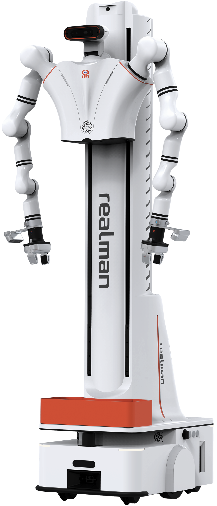
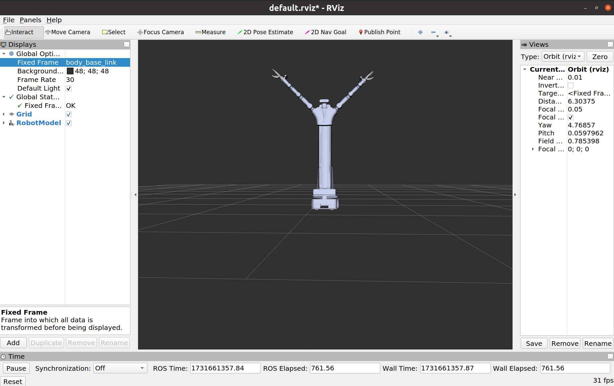
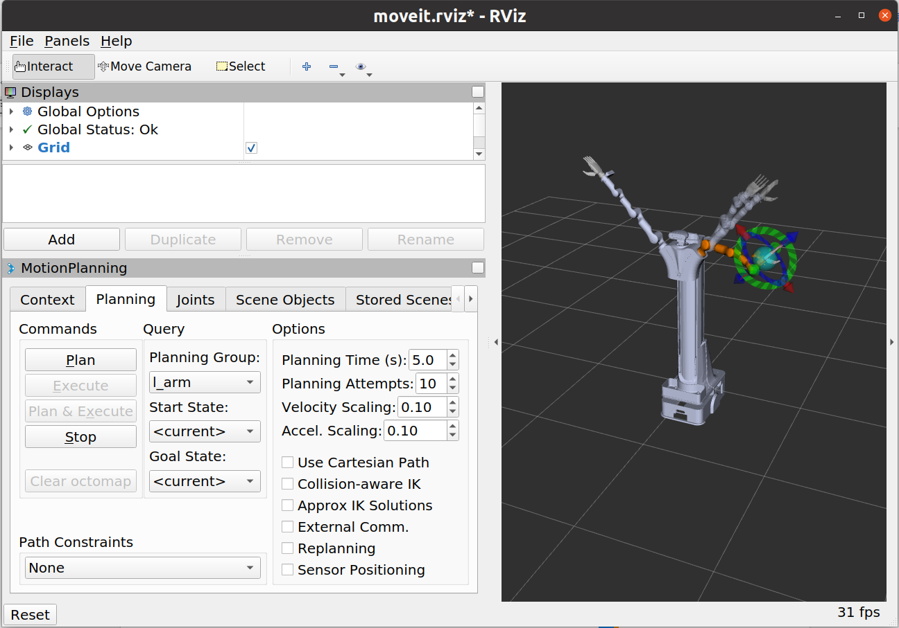
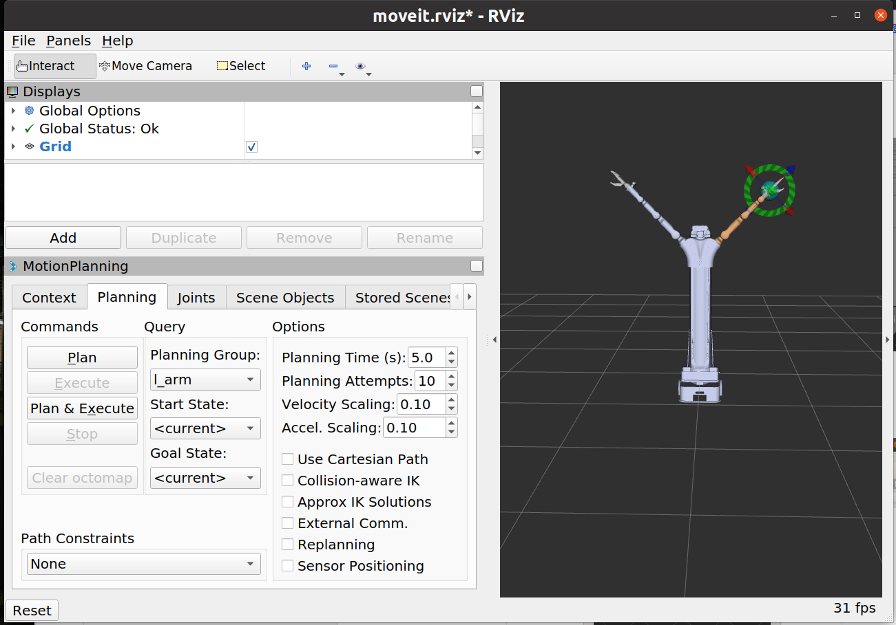
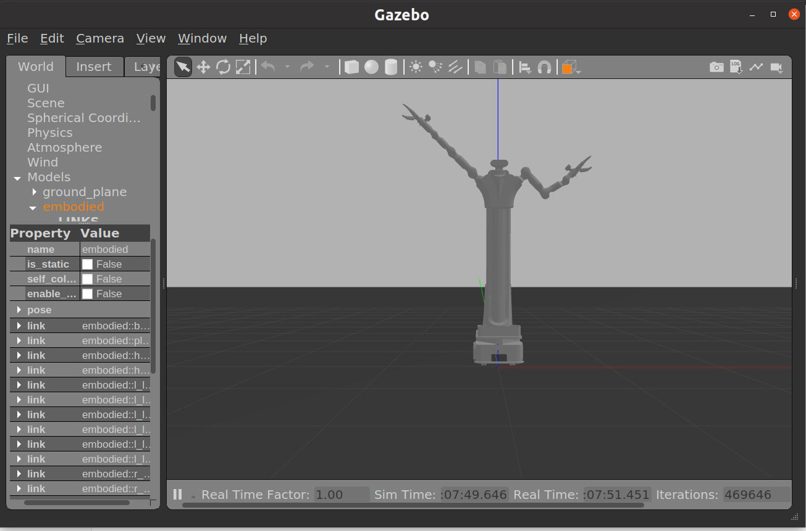

## **一.项目介绍**

- 项目概述

  开发并集成一个具身双臂机器人的ROS功能包，集成了机械臂、移动底盘、视觉传感器以及头部舵机控制模块。

- 系统组成
  1. **机械臂模块**：搭配两台7/6轴机械臂，具备单臂独立操作和双臂协同操作能力。
  2. **移动底盘模块（`AGV`）**:具备运动、导航、避障能力。
  3. **视觉传感器模块（`D435`）**：`Intel RealSense D435`相机提供了深度图像、`RGB`图像以及指定像素点的深度值，支持机器人进行环境感知、物体识别与定位等功能。
  4. **头部舵机模块**：通过控制头部舵机，机器人能够灵活地调整视角，增强对环境的观测能力。



​                                                                          图1 具身双臂机器人

- 代码版本

  `V1.0.0`
  
- 硬件环境

  | 部件名称                                                     | 硬件版本信息        | 软件版本信息                                                 |
  | ------------------------------------------------------------ | ------------------- | ------------------------------------------------------------ |
  | 机械臂                                                       | RM75-B/RM65-B       | 控制器V1.4.10及以上，API V4.2.8及以上，ROS功能包V2.0.1       |
  | 相机                                                         | Realsense D435C     | realsense-ros-2.3.2                                          |
  | 主控                                                         | jetson xavier NX    | ubuntu20.04 、ros-noetic                                     |
  | 底盘                                                         | wushi               |                                                              |
  | 头部舵机                                                     | LX-224HV 1          | 串口通信                                                     |
  | 末端工具（可选）                                             |                     |                                                              |
  | 语音模块                                                     | 轮趣 M240麦克风阵列 | 语音模块资料V5.1（https://pan.baidu.com/e/1nVS8SXqZWn5scmidNqWb7w?_at_=1724069216106） |
  | 更多信息参考：https://develop.realman-robotics.com/robot/versionComparisonTable.html ROS包下载：https://github.com/RealManRobot |                     |                                                              |
  
  
  

## 二.环境要求

- 系统：`Ubuntu `20.04

- ROS：`noetic`

  

## **三.代码结构**


```
rmc_aida_l_ros1
├── pictures
├── README_CN.md
└── src
    ├── agv_demo  调用悟时底盘ros接口样例包
    │   ├── 底盘说明文件
    │   │   ├── 底盘链接.txt
    │   │   ├── 移动机器人的ROS接口（对外） - WOOSH Robotics.pdf
    │   │   ├── Woosh Design用户指南.pdf
    │   │   ├── Woosh Design User Guide_ZH.pdf
    │   │   ├── Woosh Mobile交互软件用户指南.pdf
    │   │   ├── Woosh Mobile User Guide_ZH.pdf
    │   │   └── woosh_robot_sdk_interface_v1.1.62.pdf
    │   ├── CMakeLists.txt
    │   ├── include
    │   │   └── agv_demo
    │   ├── package.xml
    │   ├── README_AGV.md
    │   └── scripts
    │       └── agv_demo.py 样例代码
    ├── camera_demo 相机调用样例代码
    │   ├── d435_demo d435相机调用样例包
    │   │   ├── CMakeLists.txt
    │   │   ├── launch
    │   │   │   ├── d435_pub.launch
    │   │   │   └── d435_sub.launch
    │   │   ├── package.xml
    │   │   └── scripts
    │   │       ├── __init__.py
    │   │       ├── video_stream_pub.py
    │   │       └── video_stream_sub.py
    │   ├── README_D435.md  相机包调用命令文档
    │   └── usb_camera_demo usb相机调用样例包
    │       ├── CMakeLists.txt
    │       ├── config
    │       │   └── camera_params.yaml
    │       ├── include
    │       │   └── usb_camera
    │       ├── launch
    │       │   ├── usb_camera_pub.launch
    │       │   └── usb_camera_sub.launch
    │       ├── package.xml
    │       ├── scripts
    │       │   ├── video_stream_pub.py
    │       │   └── video_stream_sub.py
    │       └── src
    ├── dual_arm_control realman 双臂包
    │   ├── arm_control
    │   │   ├── CMakeLists.txt
    │   │   ├── package.xml
    │   │   └── src
    │   │       ├── arm_control.cpp
    │   │       └── cubicSpline.h
    │   ├── arm_driver
    │   │   ├── CMakeLists.txt
    │   │   ├── launch
    │   │   │   ├── dual_arm_65_driver.launch
    │   │   │   └── dual_arm_75_driver.launch
    │   │   ├── package.xml
    │   │   └── src
    │   │       ├── arm_driver.cpp
    │   │       ├── cJSON.c
    │   │       ├── cJSON.h
    │   │       └── rm_robot.h
    │   ├── arm_servo
    │   │   ├── CMakeLists.txt
    │   │   └── package.xml
    │   ├── dual_arm_description
    │   │   ├── overseas_65_b_v_description
    │   │   │   ├── CMakeLists.txt
    │   │   │   ├── config
    │   │   │   │   └── joint_names_overseas_65_b_v_description.yaml
    │   │   │   ├── export.log
    │   │   │   ├── launch
    │   │   │   │   ├── display.launch
    │   │   │   │   └── gazebo.launch
    │   │   │   ├── meshes
    │   │   │   │   ├── base_link_underpan.STL
    │   │   │   │   ├── bl_Link.STL
    │   │   │   │   ├── body_base_link.STL
    │   │   │   │   ├── br_Link.STL
    │   │   │   │   ├── camera_link.STL
    │   │   │   │   ├── fl_Link.STL
    │   │   │   │   ├── fr_Link.STL
    │   │   │   │   ├── head_link1.STL
    │   │   │   │   ├── head_link2.STL
    │   │   │   │   ├── l_base_link1.STL
    │   │   │   │   ├── l_base_link.STL
    │   │   │   │   ├── l_hand_base_link.STL
    │   │   │   │   ├── link_left_wheel.STL
    │   │   │   │   ├── link_right_wheel.STL
    │   │   │   │   ├── link_swivel_wheel_1_1.STL
    │   │   │   │   ├── link_swivel_wheel_1_2.STL
    │   │   │   │   ├── link_swivel_wheel_2_1.STL
    │   │   │   │   ├── link_swivel_wheel_2_2.STL
    │   │   │   │   ├── link_swivel_wheel_3_1.STL
    │   │   │   │   ├── link_swivel_wheel_3_2.STL
    │   │   │   │   ├── link_swivel_wheel_4_1.STL
    │   │   │   │   ├── link_swivel_wheel_4_2.STL
    │   │   │   │   ├── l_link1.STL
    │   │   │   │   ├── l_link2.STL
    │   │   │   │   ├── l_link3.STL
    │   │   │   │   ├── l_link4.STL
    │   │   │   │   ├── l_link5.STL
    │   │   │   │   ├── l_link6.STL
    │   │   │   │   ├── platform_base_link.STL
    │   │   │   │   ├── r_base_link1.STL
    │   │   │   │   ├── r_base_link.STL
    │   │   │   │   ├── r_hand_base_link.STL
    │   │   │   │   ├── r_link1.STL
    │   │   │   │   ├── r_link2.STL
    │   │   │   │   ├── r_link3.STL
    │   │   │   │   ├── r_link4.STL
    │   │   │   │   ├── r_link5.STL
    │   │   │   │   └── r_link6.STL
    │   │   │   ├── package.xml
    │   │   │   └── urdf
    │   │   │       ├── body_head_platform_transmission.xacro
    │   │   │       ├── body_head_platform.urdf.xacro
    │   │   │       ├── common_gazebo.xacro
    │   │   │       ├── joint.urdf.xacro
    │   │   │       ├── left_hand.urdf.xacro
    │   │   │       ├── overseas_65_b_v_description.csv
    │   │   │       ├── overseas_65_b_v_description.urdf
    │   │   │       ├── overseas_65_b_v_description.urdf.xacro
    │   │   │       ├── right_hand.urdf.xacro
    │   │   │       ├── rm65_b_v_left_transmission.xacro
    │   │   │       ├── rm65_b_v_left.urdf.xacro
    │   │   │       ├── rm65_b_v_right_transmission.xacro
    │   │   │       ├── rm65_b_v_right.urdf.xacro
    │   │   │       └── woosh_agv.urdf.xacro
    │   │   └── overseas_75_b_v_description
    │   │       ├── CMakeLists.txt
    │   │       ├── config
    │   │       │   └── joint_names_overseas_75_b_v_description.yaml
    │   │       ├── export.log
    │   │       ├── launch
    │   │       │   ├── display.launch
    │   │       │   └── gazebo.launch
    │   │       ├── meshes
    │   │       │   ├── base_link_underpan.STL
    │   │       │   ├── bl_Link.STL
    │   │       │   ├── body_base_link.STL
    │   │       │   ├── br_Link.STL
    │   │       │   ├── camera_link.STL
    │   │       │   ├── fl_Link.STL
    │   │       │   ├── fr_Link.STL
    │   │       │   ├── head_link1.STL
    │   │       │   ├── head_link2.STL
    │   │       │   ├── l_base_link1.STL
    │   │       │   ├── l_base_link.STL
    │   │       │   ├── l_hand_base_link.STL
    │   │       │   ├── l_hand_link.STL
    │   │       │   ├── link_left_wheel.STL
    │   │       │   ├── link_right_wheel.STL
    │   │       │   ├── link_swivel_wheel_1_1.STL
    │   │       │   ├── link_swivel_wheel_1_2.STL
    │   │       │   ├── link_swivel_wheel_2_1.STL
    │   │       │   ├── link_swivel_wheel_2_2.STL
    │   │       │   ├── link_swivel_wheel_3_1.STL
    │   │       │   ├── link_swivel_wheel_3_2.STL
    │   │       │   ├── link_swivel_wheel_4_1.STL
    │   │       │   ├── link_swivel_wheel_4_2.STL
    │   │       │   ├── l_link1.STL
    │   │       │   ├── l_link2.STL
    │   │       │   ├── l_link3.STL
    │   │       │   ├── l_link4.STL
    │   │       │   ├── l_link5.STL
    │   │       │   ├── l_link6.STL
    │   │       │   ├── l_link7.STL
    │   │       │   ├── platform_base_link.STL
    │   │       │   ├── r_base_link1.STL
    │   │       │   ├── r_base_link.STL
    │   │       │   ├── r_hand_base_link.STL
    │   │       │   ├── r_hand.STL
    │   │       │   ├── r_link1.STL
    │   │       │   ├── r_link2.STL
    │   │       │   ├── r_link3.STL
    │   │       │   ├── r_link4.STL
    │   │       │   ├── r_link5.STL
    │   │       │   ├── r_link6.STL
    │   │       │   └── r_link7.STL
    │   │       ├── no_gravity_world.world
    │   │       ├── package.xml
    │   │       └── urdf
    │   │           ├── body_head_platform_transmission.xacro
    │   │           ├── body_head_platform.urdf.xacro
    │   │           ├── common_gazebo.xacro
    │   │           ├── joint.urdf.xacro
    │   │           ├── left_hand.urdf.xacro
    │   │           ├── overseas_75_b_v_description.csv
    │   │           ├── overseas_75_b_v_description.urdf
    │   │           ├── overseas_75_b_v_description.urdf.xacro
    │   │           ├── right_hand.urdf.xacro
    │   │           ├── rm75_b_v_left_transmission.xacro
    │   │           ├── rm75_b_v_left.urdf.xacro
    │   │           ├── rm75_b_v_right_transmission.xacro
    │   │           ├── rm75_b_v_right.urdf.xacro
    │   │           └── woosh_agv.urdf.xacro
    │   ├── dual_arm_gazebo
    │   │   ├── dual_65B_arm_gazebo
    │   │   │   ├── CMakeLists.txt
    │   │   │   ├── config
    │   │   │   │   ├── arm_gazebo_joint_states.yaml
    │   │   │   │   └── rm_65_trajectory_control.yaml
    │   │   │   ├── launch
    │   │   │   │   ├── arm_65_bringup_moveit.launch
    │   │   │   │   ├── arm_65_trajectory_controller.launch
    │   │   │   │   ├── arm_gazebo_states.launch
    │   │   │   │   └── arm_world.launch
    │   │   │   ├── package.xml
    │   │   │   └── worlds
    │   │   │       └── no_gravity_world.world
    │   │   └── dual_75B_arm_gazebo
    │   │       ├── CMakeLists.txt
    │   │       ├── config
    │   │       │   ├── arm_gazebo_joint_states.yaml
    │   │       │   └── rm_75_trajectory_control.yaml
    │   │       ├── launch
    │   │       │   ├── arm_75_bringup_moveit.launch
    │   │       │   ├── arm_75_trajectory_controller.launch
    │   │       │   ├── arm_gazebo_states.launch
    │   │       │   └── arm_world.launch
    │   │       ├── package.xml
    │   │       └── worlds
    │   │           └── no_gravity_world.world
    │   ├── dual_arm_moveit
    │   │   ├── dual_65B_arm_moveit_config
    │   │   │   ├── CMakeLists.txt
    │   │   │   ├── config
    │   │   │   │   ├── cartesian_limits.yaml
    │   │   │   │   ├── chomp_planning.yaml
    │   │   │   │   ├── controllers.yaml
    │   │   │   │   ├── fake_controllers.yaml
    │   │   │   │   ├── gazebo_controllers.yaml
    │   │   │   │   ├── gazebo_overseas_65_b_v_description.urdf
    │   │   │   │   ├── joint_limits.yaml
    │   │   │   │   ├── kinematics.yaml
    │   │   │   │   ├── ompl_planning.yaml
    │   │   │   │   ├── overseas_65_b_v_description.srdf
    │   │   │   │   ├── ros_controllers.yaml
    │   │   │   │   ├── sensors_3d.yaml
    │   │   │   │   ├── simple_moveit_controllers.yaml
    │   │   │   │   └── stomp_planning.yaml
    │   │   │   ├── launch
    │   │   │   │   ├── chomp_planning_pipeline.launch.xml
    │   │   │   │   ├── default_warehouse_db.launch
    │   │   │   │   ├── demo_gazebo.launch
    │   │   │   │   ├── demo.launch
    │   │   │   │   ├── demo_realrobot.launch
    │   │   │   │   ├── dual_65B_arm_robot_moveit_controller_manager.launch.xml
    │   │   │   │   ├── dual_65B_arm_robot_moveit_sensor_manager.launch.xml
    │   │   │   │   ├── fake_moveit_controller_manager.launch.xml
    │   │   │   │   ├── gazebo.launch
    │   │   │   │   ├── joystick_control.launch
    │   │   │   │   ├── move_group.launch
    │   │   │   │   ├── moveit_65B_planning_execution_gazebo.launch
    │   │   │   │   ├── moveit_planning_execution.launch
    │   │   │   │   ├── moveit.rviz
    │   │   │   │   ├── moveit_rviz.launch
    │   │   │   │   ├── ompl-chomp_planning_pipeline.launch.xml
    │   │   │   │   ├── ompl_planning_pipeline.launch.xml
    │   │   │   │   ├── overseas_65_b_v_description_moveit_sensor_manager.launch.xml
    │   │   │   │   ├── pilz_industrial_motion_planner_planning_pipeline.launch.xml
    │   │   │   │   ├── planning_context.launch
    │   │   │   │   ├── planning_pipeline.launch.xml
    │   │   │   │   ├── ros_controllers.launch
    │   │   │   │   ├── ros_control_moveit_controller_manager.launch.xml
    │   │   │   │   ├── run_benchmark_ompl.launch
    │   │   │   │   ├── sensor_manager.launch.xml
    │   │   │   │   ├── setup_assistant.launch
    │   │   │   │   ├── simple_moveit_controller_manager.launch.xml
    │   │   │   │   ├── stomp_planning_pipeline.launch.xml
    │   │   │   │   ├── trajectory_execution.launch.xml
    │   │   │   │   ├── warehouse.launch
    │   │   │   │   └── warehouse_settings.launch.xml
    │   │   │   └── package.xml
    │   │   └── dual_75B_arm_moveit_config
    │   │       ├── CMakeLists.txt
    │   │       ├── config
    │   │       │   ├── cartesian_limits.yaml
    │   │       │   ├── chomp_planning.yaml
    │   │       │   ├── controllers.yaml
    │   │       │   ├── fake_controllers.yaml
    │   │       │   ├── gazebo_controllers.yaml
    │   │       │   ├── gazebo_overseas_75_b_v_description.urdf
    │   │       │   ├── joint_limits.yaml
    │   │       │   ├── kinematics.yaml
    │   │       │   ├── ompl_planning.yaml
    │   │       │   ├── overseas_75_b_v_description.srdf
    │   │       │   ├── ros_controllers.yaml
    │   │       │   ├── sensors_3d.yaml
    │   │       │   ├── simple_moveit_controllers.yaml
    │   │       │   └── stomp_planning.yaml
    │   │       ├── launch
    │   │       │   ├── chomp_planning_pipeline.launch.xml
    │   │       │   ├── default_warehouse_db.launch
    │   │       │   ├── demo_gazebo.launch
    │   │       │   ├── demo.launch
    │   │       │   ├── demo_realrobot.launch
    │   │       │   ├── dual_75B_arm_robot_moveit_controller_manager.launch.xml
    │   │       │   ├── dual_75B_arm_robot_moveit_sensor_manager.launch.xml
    │   │       │   ├── fake_moveit_controller_manager.launch.xml
    │   │       │   ├── gazebo.launch
    │   │       │   ├── joystick_control.launch
    │   │       │   ├── move_group.launch
    │   │       │   ├── moveit_75B_planning_execution_gazebo.launch
    │   │       │   ├── moveit_planning_execution.launch
    │   │       │   ├── moveit.rviz
    │   │       │   ├── moveit_rviz.launch
    │   │       │   ├── ompl-chomp_planning_pipeline.launch.xml
    │   │       │   ├── ompl_planning_pipeline.launch.xml
    │   │       │   ├── overseas_75_b_v_description_moveit_sensor_manager.launch.xml
    │   │       │   ├── pilz_industrial_motion_planner_planning_pipeline.launch.xml
    │   │       │   ├── planning_context.launch
    │   │       │   ├── planning_pipeline.launch.xml
    │   │       │   ├── ros_controllers.launch
    │   │       │   ├── ros_control_moveit_controller_manager.launch.xml
    │   │       │   ├── run_benchmark_ompl.launch
    │   │       │   ├── sensor_manager.launch.xml
    │   │       │   ├── setup_assistant.launch
    │   │       │   ├── simple_moveit_controller_manager.launch.xml
    │   │       │   ├── stomp_planning_pipeline.launch.xml
    │   │       │   ├── trajectory_execution.launch.xml
    │   │       │   ├── warehouse.launch
    │   │       │   └── warehouse_settings.launch.xml
    │   │       └── package.xml
    │   └── dual_arm_msgs
    │       ├── CMakeLists.txt
    │       ├── msg
    │       │   ├── Arm_Analog_Output.msg
    │       │   ├── Arm_Current_State copy.msg
    │       │   ├── Arm_Current_State.msg
    │       │   ├── Arm_Digital_Output.msg
    │       │   ├── Arm_IO_State.msg
    │       │   ├── Arm_Joint_Speed_Max.msg
    │       │   ├── Arm_Pose_Euler.msg
    │       │   ├── Arm_Software_Version.msg
    │       │   ├── ArmState.msg
    │       │   ├── Cabinet.msg
    │       │   ├── CarteFdPose.msg
    │       │   ├── CartePos.msg
    │       │   ├── ChangeTool_Name.msg
    │       │   ├── ChangeTool_State.msg
    │       │   ├── ChangeWorkFrame_Name.msg
    │       │   ├── ChangeWorkFrame_State.msg
    │       │   ├── Force_Position_Move_Joint.msg
    │       │   ├── Force_Position_Move_Pose.msg
    │       │   ├── Force_Position_State.msg
    │       │   ├── GetArmState_Command copy.msg
    │       │   ├── GetArmState_Command.msg
    │       │   ├── Gripper_Pick.msg
    │       │   ├── Gripper_Set.msg
    │       │   ├── Hand_Angle.msg
    │       │   ├── Hand_Force.msg
    │       │   ├── Hand_Posture.msg
    │       │   ├── Hand_Seq.msg
    │       │   ├── Hand_Speed.msg
    │       │   ├── IO_Update.msg
    │       │   ├── Joint_Current.msg
    │       │   ├── Joint_Enable.msg
    │       │   ├── Joint_Error_Code.msg
    │       │   ├── Joint_Max_Speed.msg
    │       │   ├── JointPos.msg
    │       │   ├── Joint_Step.msg
    │       │   ├── Joint_Teach.msg
    │       │   ├── Lift_Height.msg
    │       │   ├── Lift_Speed.msg
    │       │   ├── LiftState.msg
    │       │   ├── Manual_Set_Force_Pose.msg
    │       │   ├── MoveC.msg
    │       │   ├── MoveJ.msg
    │       │   ├── MoveJ_P.msg
    │       │   ├── MoveJ_PO.msg
    │       │   ├── MoveL.msg
    │       │   ├── Ort_Teach.msg
    │       │   ├── Plan_State.msg
    │       │   ├── Pos_Teach.msg
    │       │   ├── Servo_GetAngle.msg
    │       │   ├── Servo_Move.msg
    │       │   ├── Set_Force_Position.msg
    │       │   ├── Set_Realtime_Push.msg
    │       │   ├── Six_Force.msg
    │       │   ├── Socket_Command.msg
    │       │   ├── Start_Multi_Drag_Teach.msg
    │       │   ├── Stop.msg
    │       │   ├── Stop_Teach.msg
    │       │   ├── Tool_Analog_Output.msg
    │       │   ├── Tool_Digital_Output.msg
    │       │   ├── Tool_IO_State.msg
    │       │   └── Turtle_Driver.msg
    │       └── package.xml
    ├── dual_arm_robot_demo
    │   ├── CMakeLists.txt
    │   ├── launch
    │   │   ├── dual_arm_65_robot_start.launch
    │   │   └── dual_arm_75_robot_start.launch
    │   ├── package.xml
    │   └── scripts
    │       ├── use_65_demo_all.py
    │       └── use_75_demo_all.py
    └── servo_control 舵机ros包
        ├── README_SERVO.md
        ├── servo_demo
        │   ├── CMakeLists.txt
        │   ├── package.xml
        │   └── scripts
        │       └── servo_control_demo.py
        └── servo_ros
            ├── CMakeLists.txt
            ├── launch
            │   └── servo_start.launch
            ├── msg
            │   ├── ServoAngle.msg
            │   └── ServoMove.msg
            ├── package.xml
            └── src
                └── servo_controller.cpp

```


## **四.编译方法**

    1.cd rmc_aida_l_ros1
    2.catkin build dual_arm_msgs
    3.catkin build


## 五.运行指令


### 5.1**启动具身双臂机器人机械臂ROS控制节点**：

- `cd rmc_aida_l_ros1`
- `source devel/setup.bash`
- `roslaunch arm_driver dual_arm_<type>_driver.launch`     #  type 为 65 或 75


### 5.2 启动具身双臂机器人整体样例包（机械臂、舵机、USB相机、D435相机、底盘、升降）

- `cd rmc_aida_l_ros1`
- `source devel/setup.bash`
- `roslaunch dual_arm_robot_demo dual_arm_<type>_robot_start.launch`     #  type 为 65 或 75

e.g. 如果具身机器人双臂是65臂的话 ，运行指令

```
roslaunch dual_arm_robot_demo dual_arm_65_robot_start.launch
```


### 5.3**在`rviz`中显示机器人模型**


```shell
cd embodied_robot

source devel/setup.bash

roslaunch overseas_<arm_type>_b_v_description display.launch  
```


其中<arm_type>可更换为当前的机械臂型号类型 65或者75

如果具身机器人使用的是65臂的话，使用如下指令:

```     shell
roslaunch overseas_65_b_v_description display.launch
```


正常情况下如图2所示：


​                                                                         图2 在`rviz`中显示具身双臂机器人

如果 `rviz` 中未显示模型，则手动修改“Fixed Frame”为“body_base_link”，然后点

击左侧下方的 Add 按钮在弹出的界面中找到“`RobotModel`”添加即可


### 5.4 **运行 具身双臂机器人的`MoveIt!`演示demo** 


打开终端进入工作空间执行以下命令运行具身机器人的`MoveIt!`演示 demo：

```shell
cd embodied_robot

source devel/setup.bash

roslaunch  dual_<arm_type>B_arm_moveit_config demo.launch
```

其中<arm_type>可以为65或75。如在具身双臂机器人使用 `RM65 `机械臂时使用如下指令。

```shell
roslaunch dual_65B_arm_moveit_config demo.launch
```

启动成功后，可以看到如图所示的界面：


​									        图3 `MoveIt! `demo的启动界面


**拖动规划**

拖动机械臂的前端，可以改变机械臂的姿态。然后在 Planning 标签页中点

击“Plan & Execute”按钮，`MoveIt!`开始规划路径，并且控制机器人向目标位置移

动，从右侧界面可以看到机器人运动的全部过程。




​                                                                                  图4 拖动规划的运动效果

**选择目标姿态规划**

在 Planning 标签页中点击 Goal State 的下拉列表可以选择机械臂的目标姿

态，然后点击“Plan & Execute”按钮，`MoveIt!`开始规划路径，并且控制机器人向

目标位置移动。


### 5.5  **使用** **`MoveIt!`控制Gazebo** **中的机械臂**

执行以下命令运行 `MoveIt!`和 Gazebo:

```shell

cd embodied_robot

source devel/setup.bash

roslaunch dual_<arm_type>B_arm_gazebo arm_<arm_type>_bringup_moveit.launch 

```

当具身双臂机器人使用的是`RM65` 机械臂时，需要运行如下指令。

```shell
roslaunch dual_65B_arm_gazebo arm_65_bringup_moveit.launch 
```


启动后打开的 Gazebo 如图5：


​                                                                       图5 具身双臂机器人在Gazebo中显示效果

​                                                              

启动后打开的 `rviz `如图6所示：



​								        图6 `rviz`中显示具身双臂机器人

接下来使用 `MoveIt!`规划运动的几种方式就可以控制 Gazebo 中的机器人了，例如图7拖动机器人机械臂末端到一个位置，然后点击“Plan & Execute”按钮，可以看到`rviz`中机器人开始规划执行并且可以看到Gazebo中的机器人开始运动且与`rviz `中的机器人模型保持一致，如图 8所示。


​                                                                          图7 使用`MoveIt!`拖动规划执行



​								    图8 Gazebo中机器人按`rviz`规划同步执行效果


### 5.6使用 `MoveIt!`控制真实机械臂

执行以下命令运行 `MoveIt!`和机械臂:

```shell
cd rmc_aida_l_ros1

source devel/setup.bash

roslaunch dual_<arm_type>B_arm_moveit_config moveit_planning_execution.launch 


```

当具身机器人是`RM65 `机械臂时，需要运行如下指令。

```shell
roslaunch dual_65B_arm_moveit_config moveit_planning_execution.launch 
```

​                                                              

启动后打开的 `rviz `如图9所示：


​                                                                           图9 `rviz`中显示具身双臂机器人

接下来使用 `MoveIt!`规划运动的几种方式就可以控制 Gazebo 中的机器人了，例如图10拖动机器人末端到一个位置，然后点击“Plan & Execute”按钮，可以看到具身双臂机器人的真实机械臂开始执行，到达和`moveIt!`中机械臂一样的位置。


​                                                                          图10 使用`MoveIt!`拖动规划执行
